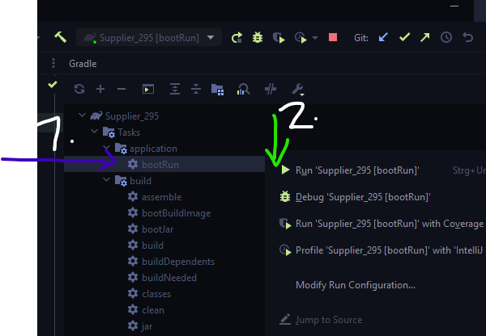

# uek295_JasminJ

# Documentation

## Beschreibung

Dies ist mein Repository für das Abschlussprojekt des überbetrieblichen Kurses (üK295, Backend für Applikationen realisieren)
Ich habe eine REST-API-Applikation programmiert, welche Autoren in einer Datenbank persistiert. Dieses Programm wurde in Java und mit dem Spring-Boot-Framework geschrieben.

Für weitere Informationen zum üK295 besuchen Sie die folgende Webseite:
Modulbaukasten: https://www.modulbaukasten.ch/module/295/1/de-DE?title=Backend-f%C3%BCr-Applikationen-realisieren


## Vorbereitungen

Folgende Software müssen Sie auf Ihrem PC/Laptop installiert haben, bevor Sie mein Programm nutzen können:  
- Docker [Download Link](https://docs.docker.com/get-docker/)
- Intellij [Download Link](https://www.jetbrains.com/idea/)
- Postman [Download Link](https://www.postman.com/downloads/)

Folgende Software brauchen Sie um das Programm von meinem Repository beziehen zu können:
- Git, Git Bash [Download Link](https://git-scm.com/downloads)


## Installation

### Git

Zuerst öffnen Sie an einem beliebigen Speicherort die Applikation 'Git Bash'. 
Wenn diese geöffnet wurde, müssen Sie mit folgendem Befehl das Repository 'klonen'/herunterladen:

```bash
git clone https://github.com/xmin12/uk295_JasminJ.git
```

### Docker

Danach müssen Sie die Applikatio 'Docker' öffnen. Dies kann einen Moment dauern. 
Um nun einen Postgres-Docker-Container zu starten sollten sie im CMD/Kommandozeile (suchen Sie CMD auf Ihrem Arbeitsgerät) 
und geben Sie folgenden Befehl ein:

```bash
docker run -d -p 5432:5432 -e POSTGRES_PASSWORD=postgres --name uek295db postgres
```

Der Name, das Passwort und der Port sollten wie folgt lauten:
- Name: uek295db
- POSTGRES_PASSWORD: postgres
- port: 5432

Damit Sie sicherstellen können, ob der Docker-Container läuft, sollten Sie im CMD/Kommandozeile folgenden Befehl eingeben:

```bash
docker ps
```

### Intellij

1. Nun öffnen Sie die Intellij Applikation und öffnen mein Programm. 
Dieses finden Sie an jenem Ort, an dem Sie das Repository geklont/gespeichert haben.
2. Wenn das Programm geöffnet ist, können Sie es mit dem grünen Pfeil (dieser sollte sie oben im Fenster zu finden sein) drücken, um das Programm zu starten. 
Falls dies nicht klappen würde, sollten Sie folgende Schritte machen:

    Sie klicken wie im unteren Bild auf das Elefanten-Symbol/Gradle-Symbol. 

    

    Danach klicken Sie auf das Zeichen, sollten Sie auf das Zeichen mit den zwei Pfeilen.

    

    Dann öffnen Sie den Ordner 'Application'

    

    Dann machen Sie einen Rechtsklick auf das Zahnrad mit dem Namen 'BootRun'
    Dann klicken Sie auf den grünen Pfeil.

    


## Dokumentation der Endpoints

Die Dokumentation der Endpoints finden Sie, nachdem Sie das Programm in Intellij gestartet haben und der Docker-Container läuft auf folgendem Link:

http://localhost:8080/swagger-ui/index.html oder [hier](http://localhost:8080/swagger-ui/index.html)

